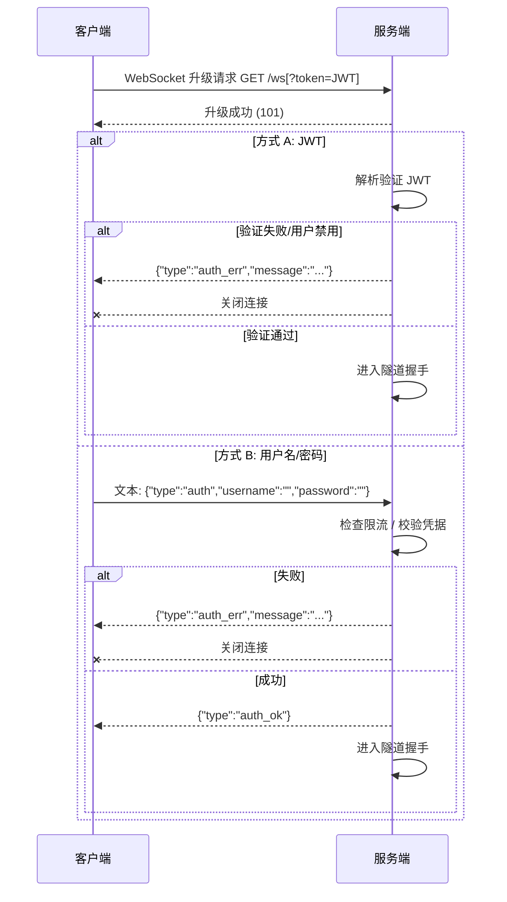
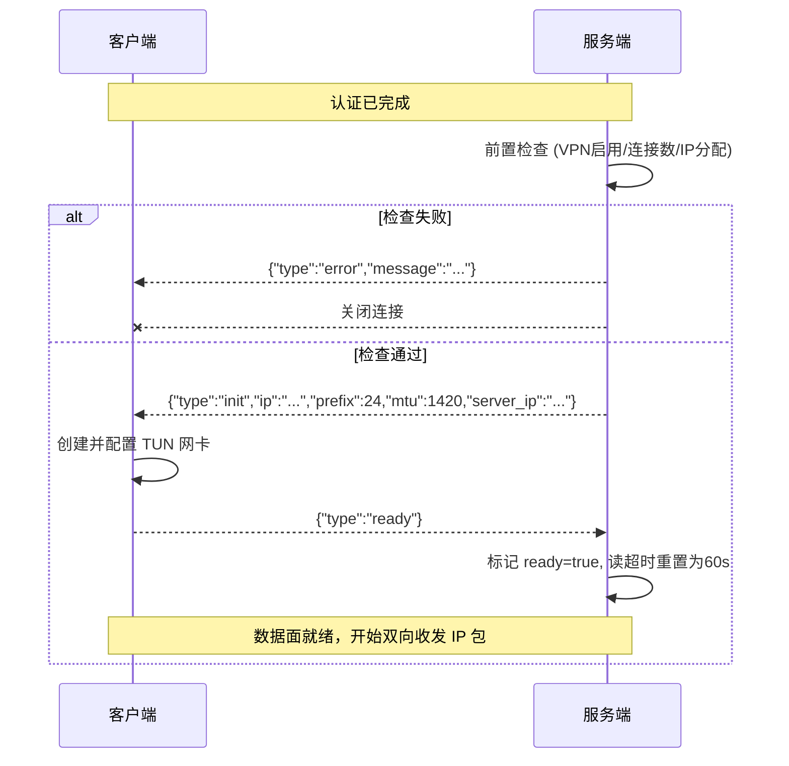

# LMVPN 客户端开发文档

> 本文档面向 LMVPN 客户端开发者，描述客户端与服务端之间的通信协议规范。
>
> **数据来源**：本文档所有字段、阈值、行为描述均严格对应 `lmvpn_server` 的 Go 源码实现，标注格式为 `文件:行号`，便于核对。本文档不依赖任何测试脚本或外部示例。
>
> **定位**：纯协议规范，平台无关，不含完整客户端实现代码。客户端开发者可据此在任意语言/平台实现兼容的客户端。

---

## 目录

1. [概述与架构](#1-概述与架构)
2. [术语与消息分类](#2-术语与消息分类)
3. [传输层规范](#3-传输层规范)
4. [认证协议](#4-认证协议)
5. [隧道握手协议](#5-隧道握手协议)
6. [数据平面](#6-数据平面)
7. [心跳与保活](#7-心跳与保活)
8. [限制与配额](#8-限制与配额)
9. [错误码与控制消息](#9-错误码与控制消息)
10. [消息格式速查表](#10-消息格式速查表)
11. [TUN 接口配置说明](#11-tun-接口配置说明)
12. [服务端配套依赖](#12-服务端配套依赖)
13. [典型问题排查](#13-典型问题排查)
14. [附录 A：关键常量表](#附录-a关键常量表)
15. [附录 B：源码文件索引](#附录-b源码文件索引)

---

## 1. 概述与架构

### 1.1 什么是 LMVPN

LMVPN 是一个基于 WebSocket 隧道与 TUN 虚拟网卡的 VPN 系统。服务端通过 WebSocket 与客户端建立控制通道，TUN 网卡与 WebSocket 之间双向搬运原始 IP 数据包，实现三层（网络层）VPN 隧道。

### 1.2 架构拓扑

```
┌─────────────┐         WebSocket (ws/wss)          ┌─────────────┐
│   客户端     │ ◄─────────────────────────────────► │   服务端     │
│             │   控制消息: 文本帧 (JSON)             │             │
│  TUN 网卡   │   数据消息: 二进制帧 (IP 包)          │  TUN 网卡   │
│  (utun/tun) │                                    │  (tun0/...) │
└──────┬──────┘                                    └──────┬──────┘
       │                                                  │
       │ 应用层流量                                        │ 物理网卡
       ▼                                                  ▼
   应用程序                                          公网 / 局域网
```

### 1.3 工作原理

1. 客户端通过 WebSocket 连接服务端 `/ws` 端点
2. 完成身份认证（JWT 或用户名/密码）
3. 服务端为客户端分配 VPN 内网 IP，发送 `init` 消息
4. 客户端据此配置本地 TUN 网卡，回复 `ready`
5. 此后双方通过二进制 WebSocket 帧互传 IP 数据包：
   - 客户端 TUN 读到的包 → WebSocket 二进制帧 → 服务端 TUN 写入（出网）或转发给其他客户端
   - 服务端 TUN 读到的包 → WebSocket 二进制帧 → 客户端 TUN 写入（下行流量）

### 1.4 角色定义

| 角色 | 说明 |
|------|------|
| **Server** | LMVPN 服务端，监听 WebSocket，管理 TUN 网卡、IP 分配、包转发 |
| **Client** | LMVPN 客户端，连接服务端，维护本地 TUN 网卡，收发 IP 包 |
| **TUN** | 虚拟网卡，Linux 为 `tunN`，macOS 为 `utunN`，Windows 为 wintun |

---

## 2. 术语与消息分类

WebSocket 连接上的消息分为两类：

### 2.1 文本消息（Text Message）

UTF-8 编码的 JSON 文本，用于**控制面**：认证、握手、错误通知。所有控制消息均含 `type` 字段标识类型。

涉及的 `type` 取值：`auth`、`auth_ok`、`auth_err`、`init`、`ready`、`error`。

### 2.2 二进制消息（Binary Message）

原始 IP 数据包（IPv4 或 IPv6），用于**数据面**。二进制帧**不是** JSON，不包含任何包装/封装头，就是裸 IP 包。

> ⚠️ 客户端不应向服务端发送既非合法 JSON 控制消息、也非合法 IP 包的二进制数据——服务端会解析失败并丢弃，但不会断开连接（`internal/vpn/tunnel.go:170-185`）。

---

## 3. 传输层规范

### 3.1 WebSocket 端点

| 项目 | 值 | 源码 |
|------|----|----|
| 路径 | `GET /ws` | `internal/router/router.go:15` |
| 协议 | WebSocket（RFC 6455） | `internal/vpn/handler.go:32-39` |
| 子协议 | 无 | — |
| 读缓冲 | 4096 字节 | `internal/vpn/handler.go:17` |
| 写缓冲 | 4096 字节 | `internal/vpn/handler.go:18` |

### 3.2 Origin 校验

服务端对 WebSocket 升级请求的 `Origin` 头做如下校验（`internal/vpn/handler.go:19-29`）：

- `Origin` 头**为空**：**放行**（非浏览器客户端场景）
- `Origin` 头**非空**：解析其 host 部分，**必须等于**请求本身的 host，否则拒绝升级

> 客户端实现建议：非浏览器环境可不发送 `Origin` 头，或发送与目标 host 一致的 Origin，避免被拒。

### 3.3 WSS / 反向代理

生产环境服务端通常仅监听 HTTP 或 Unix Socket（`main.go:47-83`），由反向代理（如 Caddy/Nginx）提供 HTTPS/WSS 终结。客户端连接时应使用 `wss://` 协议并连接反向代理地址。

> 服务端默认监听 TCP `:8080` 与 Unix Socket `/run/lmvpnweb.sock`（`internal/config/config.go:32-46`），实际地址以部署为准。

---

## 4. 认证协议

客户端必须在 WebSocket 连接建立后完成认证，否则无法进入隧道握手阶段。认证方式二选一。

### 4.1 方式 A：JWT（query 参数）

#### 4.1.1 获取 JWT

通过 HTTP 登录接口获取：

| 项目 | 值 | 源码 |
|------|----|----|
| 方法 | `POST` | `internal/router/router.go:17` |
| 路径 | `/api/login` | 同上 |
| 限流 | 5 次/分钟·IP（超出返回 `429`） | `internal/middleware/ratelimit.go:75-86` |

**请求体**（JSON）：

```json
{ "username": "alice", "password": "secret" }
```

| 字段 | 类型 | 必填 | 说明 |
|------|------|------|------|
| `username` | string | 是 | 用户名 |
| `password` | string | 是 | 明文密码 |

**成功响应**（`200`，`internal/handler/auth.go:21-30,74-82`）：

```json
{
  "token": "eyJhbGciOiJIUzI1NiIs...",
  "user": { "id": 2, "username": "alice", "role": "user" }
}
```

| 字段 | 类型 | 说明 |
|------|------|------|
| `token` | string | JWT，用于 WebSocket 认证 |
| `user.id` | uint | 用户 ID |
| `user.username` | string | 用户名 |
| `user.role` | string | 角色（`user` / `admin`） |

**失败响应**：

| HTTP 状态 | 场景 | 响应体 | 源码 |
|-----------|------|--------|------|
| `400` | 参数缺失 | `{"error":"请输入用户名和密码"}` | `auth.go:34-37` |
| `401` | 用户名不存在 / 密码错误 | `{"error":"用户名或密码错误"}` | `auth.go:40-48` |
| `403` | 账号已禁用（`status != 1`） | `{"error":"账号已被禁用"}` | `auth.go:50-53` |
| `429` | 限流 | `{"error":"请求过于频繁，请稍后再试"}` | `ratelimit.go:79-81` |
| `500` | 生成令牌/会话失败 | `{"error":"生成令牌失败"}` 等 | `auth.go:57-72` |

#### 4.1.2 JWT 规格

| 项目 | 值 | 源码 |
|------|----|----|
| 签名算法 | HS256 | `internal/middleware/auth.go:43` |
| 有效期 | 24 小时 | `internal/middleware/auth.go:15,39` |
| 密钥来源 | 服务端配置（见 §12） | `internal/config/config.go:84-98` |

**Claims 字段**（`internal/middleware/auth.go:23-29`）：

| 字段 | 类型 | 说明 |
|------|------|------|
| `session_id` | string | 会话 ID（UUID） |
| `user_id` | uint | 用户 ID |
| `username` | string | 用户名 |
| `role` | string | 角色 |
| `exp` | numeric date | 过期时间（标准 JWT claim） |
| `iat` | numeric date | 签发时间（标准 JWT claim） |

#### 4.1.3 使用 JWT 连接

将 JWT 作为 query 参数附加到 WebSocket URL：

```
ws://host:port/ws?token=<JWT>
wss://host/ws?token=<JWT>
```

服务端处理逻辑（`internal/vpn/handler.go:33,41-56`）：

- 若 `token` 参数非空，解析并验证 JWT
- 验证失败 → 发送 `{"type":"auth_err","message":"令牌无效或已过期"}` 并关闭连接
- 用户不存在或 `status != 1` → 发送 `{"type":"auth_err","message":"用户不存在或已禁用"}` 并关闭连接
- 验证通过 → **直接进入隧道握手**（无需再发送 `auth` 消息）

> ℹ️ **JWT 路径不触发密码认证限流**。密码认证限流仅作用于方式 B。

### 4.2 方式 B：用户名/密码（首条消息）

连接 WebSocket 后（不带 `token` 参数），客户端须**立即**发送一条文本消息完成认证。

#### 4.2.1 认证消息

```json
{ "type": "auth", "username": "alice", "password": "secret" }
```

| 字段 | 类型 | 必填 | 说明 | 源码 |
|------|------|------|------|------|
| `type` | string | 是 | 固定值 `"auth"` | `internal/vpn/auth.go:17-21,35` |
| `username` | string | 是 | 用户名 | 同上 |
| `password` | string | 是 | 明文密码 | 同上 |

> ⚠️ 这必须是连接建立后客户端发送的**第一条**消息。服务端读取的第一条消息若不是合法的 `auth` JSON，连接将被关闭（`internal/vpn/auth.go:29-39`）。

#### 4.2.2 认证响应

| 响应 | 含义 | 源码 |
|------|------|------|
| `{"type":"auth_ok"}` | 认证成功，进入隧道握手 | `internal/vpn/auth.go:61-65` |
| `{"type":"auth_err","message":"..."}` | 认证失败，随后服务端关闭连接 | `internal/vpn/auth.go:36,43,50,56` |

`auth_err` 的 `message` 可能取值见 [§9.2](#92-auth_err-文案表)。

#### 4.2.3 密码认证限流

| 项目 | 值 | 源码 |
|------|----|----|
| 限流键 | `客户端IP + ":" + 用户名` | `internal/vpn/auth.go:41` |
| 阈值 | 5 次/分钟 | `internal/vpn/auth.go:15` |
| 触发后行为 | 发送 `auth_err` "认证尝试过于频繁，请稍后再试" 并关闭连接 | `internal/vpn/auth.go:42-46` |

> 注意：限流在**读取并解析**到合法 `auth` 消息后才检查。若首条消息不是合法 JSON 或 `type != "auth"`，直接关闭连接，不消耗限流配额（`internal/vpn/auth.go:35-39`）。

### 4.3 用户状态要求

无论哪种认证方式，用户必须满足 `status = 1`（启用状态）。被禁用的用户（`status != 1`）无法认证通过（`internal/vpn/auth.go:49`、`internal/vpn/handler.go:49`）。

### 4.4 认证流程图



---

## 5. 隧道握手协议

认证通过后，服务端进入 `runTunnel` 流程（`internal/vpn/tunnel.go:83`），执行前置检查、IP 分配、发送 `init`，并等待客户端 `ready`。

### 5.1 前置检查

服务端在分配 IP 前依次检查，任一失败则发送 `error` 消息并**关闭连接**（不进入握手）：

| 检查项 | 失败消息 | 源码 |
|--------|----------|------|
| VPN 服务已启用（`VPN.Running()`） | `{"type":"error","message":"VPN 服务未启用"}` | `internal/vpn/tunnel.go:86-89` |
| 该用户连接数 < 3 | `{"type":"error","message":"连接数已达上限"}` | `internal/vpn/tunnel.go:91-97` |
| IP 分配成功 | `{"type":"error","message":"分配 IP 失败: <原因>"}` | `internal/vpn/tunnel.go:109-113` |

### 5.2 IP 分配规则

服务端从 VPN 子网中分配客户端内网 IP（`internal/vpn/alloc.go:39-66`、`internal/vpn/service.go:47-58`）：

| 地址 | 分配规则 | 说明 |
|------|----------|------|
| 子网第 1 个主机地址 | **服务器 IP**（固定） | `cidr.Host(ipNet, 1)` |
| 子网第 2 个主机地址起 | **动态分配**给客户端 | 首次可用地址 |
| 预留地址 | 按 userID 绑定的固定 IP | 优先于动态分配 |

- 子网第 0 个地址为网络地址，保留不分配
- 子网最后地址为广播地址，保留不分配
- 故可用容量 = `AddressCount - 3`（`internal/vpn/alloc.go:106-112`）
- 若该用户有预留 IP，优先使用预留；预留被占用时报错（`alloc.go:43-48`）
- 地址耗尽时报错 "可用 IP 地址已耗尽"（`alloc.go:65`）

#### IPv6 双栈

当服务端配置了 IPv6 子网（`Subnet6`）时，客户端同时获得 IPv4 和 IPv6 地址：

- IPv4 地址始终分配（`Subnet` 必填）
- IPv6 地址仅当 `Subnet6` 非空时分配（可选）
- IPv6 预留独立于 IPv4 预留，可单独配置
- IPv6 子网前缀限制：`/64` ~ `/126`
- 对于 `/64` 等大子网，`cidr.AddressCount` 会溢出，实际扫描上限为 65536 个地址

### 5.3 init 消息

前置检查通过后，服务端发送 `init` 文本消息（`internal/vpn/tunnel.go:132-148`）：

```json
{
  "type": "init",
  "ip": "10.0.0.5",
  "prefix": 24,
  "mtu": 1420,
  "server_ip": "10.0.0.1",
  "ip6": "fd00:dead:beef::5",
  "prefix6": 112,
  "server_ip6": "fd00:dead:beef::1"
}
```

| 字段 | 类型 | 必填 | 说明 | 源码 |
|------|------|------|------|------|
| `type` | string | 是 | 固定值 `"init"` | `internal/vpn/protocol.go:3-10` |
| `ip` | string | 是 | 分配给客户端的 IPv4 地址 | `tunnel.go:136` |
| `prefix` | int | 是 | IPv4 子网前缀长度（如 `24`） | `tunnel.go:137` |
| `mtu` | int | 是 | TUN 网卡 MTU | `tunnel.go:138` |
| `server_ip` | string | 是 | 服务器 IPv4 地址 | `tunnel.go:139` |
| `ip6` | string | 否 | 分配给客户端的 IPv6 地址（仅当服务端配置了 IPv6 子网时存在） | `tunnel.go:141-144` |
| `prefix6` | int | 否 | IPv6 子网前缀长度 | `tunnel.go:142` |
| `server_ip6` | string | 否 | 服务器 IPv6 地址 | `tunnel.go:143` |

> ℹ️ `ip6`/`prefix6`/`server_ip6` 字段使用 `omitempty`，旧客户端可安全忽略。若服务端未配置 IPv6 子网，这三个字段不会出现。

### 5.4 ready 消息与超时

客户端收到 `init` 后，应：

1. 创建并配置本地 TUN 网卡（地址=`ip/prefix`，MTU=`mtu`，详见 [§11](#11-tun-接口配置说明)）
2. 配置完成后，**立即**发送 `ready` 文本消息：

```json
{ "type": "ready" }
```

**超时约束**（`internal/vpn/tunnel.go:142-143,187-194`）：

- 服务端发送 `init` 后将读超时设为 **30 秒**（`readyTimeout`）
- 客户端必须在此 30 秒内发送 `ready`
- 超时未收到 `ready`，服务端**关闭连接**（日志 "等待 ready 超时"）
- 在 `ready` 之前发送的二进制数据帧将被**丢弃**（不进入 TUN）

### 5.5 握手时序图



---

## 6. 数据平面

`ready` 之后，连接进入数据传输阶段。双方通过**二进制 WebSocket 帧**互传 IP 数据包。

### 6.1 二进制帧格式

二进制帧的载荷即**原始 IP 数据包**，无任何额外封装头：

- **IPv4 包**：长度 ≥ 20 字节，源/目的地址位于偏移 12-19（`internal/vpn/switch.go:83-87`）
- **IPv6 包**：长度 ≥ 40 字节，源地址偏移 8-23，目的地址偏移 24-39（`internal/vpn/switch.go:88-96`）

服务端使用 `waterutil` 库解析 IP 头以获取源/目的地址（`internal/vpn/switch.go:78-99`）。

### 6.2 数据流向

#### 6.2.1 客户端 → 服务端（上行）

客户端从本地 TUN 网卡读取 IP 包，作为二进制帧发送。服务端收到后（`internal/vpn/tunnel.go:196-207`）：

1. 统计接收字节数
2. 调用 `RouteFromClient` 判断转发目标（见 §6.3）
3. 若无客户端目标 → 写入服务端 TUN（经服务器出网）
4. 若有客户端目标 → 转发给目标客户端

#### 6.2.2 服务端 → 客户端（下行）

服务端从 TUN 网卡读取 IP 包，根据目的 IP 查找已连接客户端，作为二进制帧发送给对应客户端（`internal/vpn/service.go:111-135`、`internal/vpn/switch.go:129-140`）。客户端收到后写入本地 TUN。

### 6.3 转发路由判定

服务端 `PacketSwitch` 对客户端发来的包做如下判定（`internal/vpn/switch.go:108-127`）：

| 目的地址类型 | `allow_client_to_client=true` | `allow_client_to_client=false` |
|--------------|-------------------------------|--------------------------------|
| 单播 + 目的为已连接客户端 | 转发给该客户端 | 写服务器 TUN（出网） |
| 单播 + 目的非客户端 | 写服务器 TUN（出网） | 写服务器 TUN（出网） |
| 非单播（广播/多播） | 转发给所有其他客户端 | 不处理（丢弃） |

> `allow_client_to_client` 是服务端全局开关，由管理员配置（`internal/model/vpn.go:13`）。客户端无法查询此开关，应假设其可能为 `false`。

### 6.4 反欺骗（Anti-Spoofing）

服务端**强制校验**每个来自客户端的 IP 包的源地址（`internal/vpn/switch.go:113-126`）：

- **IPv4 包**：源地址必须等于客户端被分配的 IPv4 地址（`init.ip`）
- **IPv6 包**：源地址必须等于客户端被分配的 IPv6 地址（`init.ip6`）

不匹配的包将被静默丢弃（不转发、不写入 TUN、不断开连接）。

> ⚠️ 客户端必须确保 TUN 网卡只发送源地址与 `init.ip` / `init.ip6` 匹配的 IP 包。若客户端配置错误导致源 IP 不匹配，所有上行包将被静默丢弃。

### 6.5 非 IP 二进制帧

若二进制帧无法识别为 IPv4 或 IPv6（长度不足或版本字段不符），服务端直接丢弃，不报错（`internal/vpn/switch.go:78-99,109-112`）。

---

## 7. 心跳与保活

### 7.1 服务端 Ping

服务端在 `runTunnel` 启动一个 goroutine，每 **30 秒**发送一个 WebSocket **Ping 控制帧**（非文本消息，是 WebSocket 协议层的 ping）（`internal/vpn/tunnel.go:145-156`）：

```go
ticker := time.NewTicker(pingPeriod)  // 30s
conn.WriteControl(websocket.PingMessage, nil, ...)
```

### 7.2 客户端 Pong 义务

客户端必须响应 WebSocket Ping 帧回送 Pong。大多数 WebSocket 库会自动处理，但若客户端禁用了自动 pong，则需手动响应。

服务端设置 Pong 处理器（`internal/vpn/tunnel.go:158-161`）：每收到 Pong，将读超时重置为 **60 秒**。

> 若 60 秒内无任何消息（含 Pong），服务端将因读超时关闭连接。

### 7.3 超时常量

| 常量 | 值 | 含义 | 源码 |
|------|----|----|------|
| `readTimeout` | 60s | ready 后的读超时（收到任意消息或 Pong 后重置） | `internal/vpn/tunnel.go:17` |
| `writeTimeout` | 10s | 单次写操作超时（控制消息/数据帧/Ping） | `internal/vpn/tunnel.go:18` |
| `readyTimeout` | 30s | 等待客户端 `ready` 的超时 | `internal/vpn/tunnel.go:19` |
| `pingPeriod` | 30s | Ping 发送周期 | `internal/vpn/tunnel.go:20` |

### 7.4 客户端保活与重连建议

- **不要禁用** WebSocket 自动 Pong（若库支持）
- 若库不自动处理，需在收到 Ping 时立即回 Pong
- 客户端可不必主动发送 Ping（服务端单向心跳即可）
- 连接断开后建议采用**指数退避重连**（如 1s → 2s → 4s → ...，上限 60s）
- 重连后需重新走完整认证 + 握手流程
- 重连后分配的 IP 可能与上次不同（除非配置了 IP 预留）

---

## 8. 限制与配额

### 8.1 消息大小

| 限制 | 值 | 源码 |
|------|----|----|
| 单条 WebSocket 消息最大 | 1 MB（`1 << 20` 字节） | `internal/vpn/tunnel.go:21,141` |

> 超过此限制的帧会导致读错误，连接被关闭。考虑 MTU 默认 1420，单 IP 包远小于此限制，正常使用不会触发。

### 8.2 并发连接数

| 限制 | 值 | 源码 |
|------|----|----|
| 单用户最大并发连接 | 3 | `internal/vpn/tunnel.go:22,92-97` |

> 超出时新连接收到 `error` "连接数已达上限" 后被关闭。旧连接不受影响。

### 8.3 子网约束

| 约束 | 值 | 源码 |
|------|----|----|
| IPv4 版本 | 仅 IPv4 | `internal/handler/vpn.go:66-73` |
| IPv4 前缀长度 | ≤ /30 | `internal/handler/vpn.go:74-78` |
| IPv6 前缀长度 | /64 ~ /126 | `internal/handler/vpn.go:81-92` |
| 可用容量 | `AddressCount - 3` | `internal/vpn/alloc.go:106-112` |
| IPv6 大子网容量 | ~65533（/64 等大子网 AddressCount 溢出时） | `internal/vpn/alloc.go:108-110` |

### 8.4 MTU 约束

| 约束 | 值 | 源码 |
|------|----|----|
| 范围 | 500 – 65535 | `internal/handler/vpn.go:130-136` |
| 默认值 | 1420 | `internal/model/vpn.go:11` |

> MTU 由服务端管理员配置，客户端应使用 `init.mtu` 的值，不要自行设定。

---

## 9. 错误码与控制消息

### 9.1 控制消息结构

所有文本控制消息均为 JSON，通用结构（`internal/vpn/protocol.go:11-13`）：

```go
type controlMessage struct {
    Type    string `json:"type"`
    Message string `json:"message,omitempty"`
}
```

`init` 消息结构较为特殊（`internal/vpn/protocol.go:3-10`）：

```go
type initMessage struct {
    Type      string `json:"type"`
    IP        string `json:"ip"`
    Prefix    int    `json:"prefix"`
    MTU       int    `json:"mtu"`
    ServerIP  string `json:"server_ip"`
    IP6       string `json:"ip6,omitempty"`
    Prefix6   int    `json:"prefix6,omitempty"`
    ServerIP6 string `json:"server_ip6,omitempty"`
}
```

### 9.2 `auth_err` 文案表

| `message` | 触发条件 | 源码 |
|-----------|----------|------|
| `令牌无效或已过期` | JWT 认证：解析失败/过期 | `internal/vpn/handler.go:44` |
| `用户不存在或已禁用` | JWT 认证：用户不存在或 `status != 1` | `internal/vpn/handler.go:50` |
| `消息格式错误` | 密码认证：首条消息非 JSON 或 `type != "auth"` | `internal/vpn/auth.go:36` |
| `认证尝试过于频繁，请稍后再试` | 密码认证：触发限流（5/min·IP+用户名） | `internal/vpn/auth.go:43` |
| `用户名或密码错误` | 密码认证：用户不存在或密码不符 | `internal/vpn/auth.go:50,56` |

> 所有 `auth_err` 之后服务端都会**关闭连接**。

### 9.3 `error` 文案表

`error` 消息在隧道握手阶段（认证后、`init` 前或 `init` 后）发送，随后**关闭连接**：

| `message` | 触发条件 | 源码 |
|-----------|----------|------|
| `VPN 服务未启用` | `VPN.Running() == false` | `internal/vpn/tunnel.go:88` |
| `连接数已达上限` | 该用户已有 3 个活跃连接 | `internal/vpn/tunnel.go:95` |
| `分配 IP 失败: <原因>` | IP 分配失败（如耗尽、预留冲突） | `internal/vpn/tunnel.go:112` |

### 9.4 客户端对错误消息的处理建议

- 收到 `auth_err`：认证失败，连接将被关闭。应提示用户检查凭据，避免频繁重试触发限流
- 收到 `error`：服务端拒绝建立隧道。根据 `message` 区分原因：
  - "VPN 服务未启用" → 联系管理员
  - "连接数已达上限" → 等待其他连接断开或联系管理员
  - "分配 IP 失败" → 地址池耗尽，联系管理员
- 连接被服务端主动关闭时，客户端不应立即重连，应遵守退避策略

---

## 10. 消息格式速查表

### 10.1 客户端 → 服务端

| 消息 | WebSocket 类型 | 时机 | 载荷 | 示例 |
|------|----------------|------|------|------|
| `auth` | Text | 连接后立即（仅方式 B） | JSON | `{"type":"auth","username":"...","password":"..."}` |
| `ready` | Text | 收到 `init` 且 TUN 配置完成后 | JSON | `{"type":"ready"}` |
| 数据帧 | Binary | `ready` 之后 | 原始 IP 包 | （二进制） |
| Pong | WebSocket Pong | 收到服务端 Ping 时 | 空 | （由 WebSocket 库处理） |

### 10.2 服务端 → 客户端

| 消息 | WebSocket 类型 | 时机 | 载荷 | 示例 |
|------|----------------|------|------|------|
| `auth_ok` | Text | 密码认证成功（仅方式 B） | JSON | `{"type":"auth_ok"}` |
| `auth_err` | Text | 认证失败 | JSON | `{"type":"auth_err","message":"..."}` |
| `init` | Text | 认证成功且前置检查通过 | JSON | `{"type":"init","ip":"...","prefix":24,"mtu":1420,"server_ip":"...","ip6":"...","prefix6":112,"server_ip6":"..."}` |
| `error` | Text | 握手阶段失败 | JSON | `{"type":"error","message":"..."}` |
| 数据帧 | Binary | `ready` 之后，下行 IP 包 | 原始 IP 包 | （二进制） |
| Ping | WebSocket Ping | 每 30 秒 | 空 | （WebSocket 协议层） |

---

## 11. TUN 接口配置说明

客户端收到 `init` 后须自行创建并配置 TUN 网卡。本节给出各平台的配置规范（仅规范，不含完整代码）。

### 11.1 通用配置项

| 配置项 | 取值来源 | 说明 |
|--------|----------|------|
| TUN 网卡地址 (IPv4) | `init.ip` / `init.prefix` | 如 `10.0.0.5/24` |
| TUN 网卡地址 (IPv6) | `init.ip6` / `init.prefix6` | 如 `fd00:dead:beef::5/112`（可选，仅当 init 含 ip6 时） |
| MTU | `init.mtu` | 如 `1420` |
| 对端地址 / 默认路由网关 (IPv4) | `init.server_ip` | 如 `10.0.0.1` |
| 对端地址 (IPv6) | `init.server_ip6` | 如 `fd00:dead:beef::1`（可选） |

### 11.2 Linux

参考服务端实现（`internal/vpn/tun_linux.go`）：

```
# 创建 TUN（通常由库完成，如 songgao/water）
ip link set dev <tun> up
ip addr add dev <tun> <ip>/<prefix> peer <server_ip>
ip link set dev <tun> mtu <mtu>
```

IPv6（仅当 init 含 `ip6` 时）：

```
ip addr add dev <tun> <ip6>/<prefix6>
```

路由：若需将所有流量经 VPN，添加默认路由：

```
ip route add 0.0.0.0/0 dev <tun>
ip route add ::/0 dev <tun>    # IPv6 默认路由（可选）
```

### 11.3 macOS

参考服务端实现（`internal/vpn/tun_darwin.go`）。macOS 的 TUN 设备名为 `utunN`，使用 `ifconfig`：

```
ifconfig <utun> inet <ip>/<prefix> <server_ip> up
ifconfig <utun> mtu <mtu>
```

IPv6（仅当 init 含 `ip6` 时）：

```
ifconfig <utun> inet6 <ip6>/<prefix6> up
```

路由：

```
route add -inet -net 0.0.0.0/0 -interface <utun>
route add -inet6 -net ::/0 -interface <utun>    # IPv6 默认路由（可选）
```

> macOS 的 utun 接口由系统分配编号（如 `utun4`），客户端通常无法指定名称。

### 11.4 Windows

Windows 无原生 TUN，需使用 **wintun** 驱动。客户端须：

1. 加载 wintun.dll
2. 创建 wintun 适配器
3. 设置 IP 地址、前缀、MTU
4. 配置路由

具体 API 参考 wintun 官方文档，本文档不展开。

### 11.5 关于 `DoRemoteIPConfig`

服务端配置中有 `DoRemoteIPConfig` 字段（`internal/model/vpn.go:15`），原意为"由服务端远程配置客户端 TUN"。但当前隧道实现中**未使用**该字段——客户端始终需要根据 `init` 消息**自行配置** TUN 网卡。客户端开发者不应假设服务端会代为配置。

### 11.6 权限要求

创建和配置 TUN 网卡需要提升权限：

| 平台 | 权限 |
|------|------|
| Linux | root 或 `CAP_NET_ADMIN` 能力 |
| macOS | root（sudo） |
| Windows | 管理员权限 |

---

## 12. 服务端配套依赖

客户端能否通过 VPN 上网，取决于服务端的网络配置。客户端开发者应了解以下服务端前提（用于排查问题）。

### 12.1 IP 转发

Linux 服务端须开启 IP 转发（`internal/vpn/diag_linux.go:53-60`）：

```
sysctl -w net.ipv4.ip_forward=1
```

IPv6 双栈场景还须开启 IPv6 转发（`internal/vpn/diag_linux.go:116-122`）：

```
sysctl -w net.ipv6.conf.all.forwarding=1
```

### 12.2 NAT 伪装

服务端须配置 NAT masquerade，将客户端源 IP 转换为服务器物理网卡 IP（`internal/vpn/diag_linux.go:80-113`）。

**nft（推荐）**：

```
nft add table ip nat
nft add chain ip nat postrouting { type nat hook postrouting priority 100 \; }
nft add rule ip nat postrouting oifname <物理网卡> masquerade
```

**iptables（回退）**：

```
iptables -t nat -A POSTROUTING -o <物理网卡> -j MASQUERADE
```

IPv6 NAT66（仅双栈场景需要）：

**nft**：
```
nft add rule inet lmvpn_nat postrouting oifname <物理网卡> ip6 saddr <VPN_V6_SUBNET> masquerade
```

**ip6tables（回退）**：
```
ip6tables -t nat -A POSTROUTING -s <VPN_V6_SUBNET> -o <物理网卡> -j MASQUERADE
```

> 服务端诊断接口 `GET /api/admin/vpn/diag`（`internal/handler/vpn.go:190-192`）会检测上述配置（含 IPv6），客户端无法上网时可请管理员查看诊断结果。

### 12.3 子网与 MTU

由管理员通过 `PUT /api/admin/vpn/settings` 配置（`internal/handler/vpn.go:110-163`），客户端通过 `init` 消息获取，无需也无法自行指定。

---

## 13. 典型问题排查

| 现象 | 可能原因 | 排查建议 |
|------|----------|----------|
| 连接后立即收到 `auth_err` | 凭据错误 / JWT 过期 / 用户被禁用 | 检查用户名密码；重新登录获取 JWT；联系管理员启用账号 |
| 认证频繁失败 | 触发限流（5/min） | 等待 1 分钟后重试 |
| 收到 `error` "VPN 服务未启用" | 管理员未启用 VPN | 联系管理员 |
| 收到 `error` "连接数已达上限" | 该用户已有 3 个连接 | 关闭其他连接或联系管理员 |
| 收到 `error` "分配 IP 失败" | 地址池耗尽 | 联系管理员扩大子网 |
| 收到 `init` 后 30s 断开 | 未在超时内发送 `ready` | 检查 TUN 配置是否成功；确保配置后立即发 `ready` |
| `ready` 后能连接但无法上网 | 服务端未开 ip_forward / NAT；或客户端未配路由 | 请管理员检查 `GET /api/admin/vpn/diag`；检查客户端默认路由 |
| `ready` 后能连网但部分应用不通 | MTU 过大导致分片丢弃 | 确认 TUN MTU 与 `init.mtu` 一致 |
| 上行流量被静默丢弃 | 源 IP 与分配 IP 不匹配（反欺骗） | 确认 TUN 网卡地址为 `init.ip`，无其他地址干扰 |
| 连接频繁断开 | 60s 内无消息（未响应 Ping） | 确保未禁用 WebSocket 自动 Pong |
| 连接被意外关闭 | 单条消息超过 1MB | 检查是否有异常大的非 IP 包被发送 |

---

## 附录 A：关键常量表

| 常量 | 值 | 含义 | 源码位置 |
|------|----|----|---------|
| `readTimeout` | 60s | ready 后读超时 | `internal/vpn/tunnel.go:17` |
| `writeTimeout` | 10s | 写操作超时 | `internal/vpn/tunnel.go:18` |
| `readyTimeout` | 30s | 等待 ready 超时 | `internal/vpn/tunnel.go:19` |
| `pingPeriod` | 30s | Ping 周期 | `internal/vpn/tunnel.go:20` |
| `maxMessageSize` | 1 MB | 单消息上限 | `internal/vpn/tunnel.go:21` |
| `maxConnsPerUser` | 3 | 单用户并发连接上限 | `internal/vpn/tunnel.go:22` |
| `tokenExpire` | 24h | JWT 有效期 | `internal/middleware/auth.go:15` |
| 登录限流 | 5/min·IP | `/api/login` 限流 | `internal/middleware/ratelimit.go:76` |
| 密码认证限流 | 5/min·(IP+用户名) | WebSocket 密码认证限流 | `internal/vpn/auth.go:15,41` |
| MTU 范围 | 500–65535 | 配置校验范围 | `internal/handler/vpn.go:131` |
| MTU 默认 | 1420 | 数据库默认值 | `internal/model/vpn.go:11` |
| 子网前缀上限 | /30 | 配置校验 | `internal/handler/vpn.go:75` |
| WebSocket 读缓冲 | 4096 B | — | `internal/vpn/handler.go:17` |
| WebSocket 写缓冲 | 4096 B | — | `internal/vpn/handler.go:18` |

---

## 附录 B：源码文件索引

客户端开发者重点阅读的服务端源码文件：

| 文件 | 内容 |
|------|------|
| `internal/vpn/handler.go` | WebSocket 升级、认证入口、JWT 处理 |
| `internal/vpn/auth.go` | 密码认证逻辑、限流 |
| `internal/vpn/tunnel.go` | 隧道主循环、握手、心跳、数据收发 |
| `internal/vpn/protocol.go` | 控制消息结构定义（`init`/`controlMessage`） |
| `internal/vpn/switch.go` | 包转发路由判定、反欺骗、C2C 开关 |
| `internal/vpn/alloc.go` | IP 分配与预留逻辑 |
| `internal/vpn/service.go` | VPN 服务管理、TUN 读写循环 |
| `internal/vpn/tun_linux.go` | Linux TUN 配置（客户端配置可参考） |
| `internal/vpn/tun_darwin.go` | macOS TUN 配置（客户端配置可参考） |
| `internal/middleware/auth.go` | JWT 生成与解析、Claims 结构 |
| `internal/handler/auth.go` | 登录接口 `POST /api/login` |
| `internal/handler/vpn.go` | VPN 设置/状态/预留管理 API |
| `internal/router/router.go` | 路由表（`/ws`、`/api/*`） |
| `internal/model/vpn.go` | VPN 设置数据模型 |
| `internal/model/user.go` | 用户数据模型 |
| `internal/config/config.go` | 服务端配置结构 |
